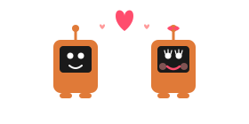

# Hinge Dating Profile Optimizer

**A Claude Skill for Claude Desktop & Claude.ai**

  

---

Everyone has something. The way they think, what they care about, their weird specific interests, how they show up for people, what makes them laugh.

Most dating profiles bury this under generic prompts and bad photo choices.

This skill finds it and puts it where people can see it.

---

## ⏱️ Time Investment

**This takes 45 minutes.**

Not a quick fix. Not "5 tips for better prompts."

This is the full process: research-backed audit, proper discovery interview, strategic photo selection, copy that sounds like you, settings optimization, and implementation support.

Strap in. It's a small investment to meet your life partner. Or your weekend 9/10 hookup. We don't judge.

---

## This Isn't Copy-Paste Advice

Most "profile tips" give you a template and send you on your way. Generic prompts, generic results.

This is a **structured 8-phase process** that actually gets to know you first:

| Phase | What Happens |
|-------|--------------|
| [Setup](SKILL.md#phase-0-setup--framing) | Frame the process, understand your situation |
| [Audit](references/audit-criteria.md) | Score your current profile (skip if starting fresh) |
| [Discovery](references/discovery-questions.md) | The big interview - find what actually makes you *you* |
| [Reality Check](SKILL.md#phase-3-reality-check) | Honest market math - who are you competing for? |
| [Photos](references/photo-guidelines.md) | Evaluate, order, identify gaps |
| [Copy](references/copy-principles.md) | Write prompts using *your* material, not templates |
| [Settings](references/hinge-settings.md) | Optimize visibility, hide the clutter |
| [Implementation](SKILL.md#phase-7-implementation) | Put it live together |
| [Algorithm](SKILL.md#phase-8-algorithm-strategy) | What to do in weeks 1-4 |

**Why it works:** The discovery phase is the key. Most advice is generic because it doesn't know you. This spends real time understanding your humor, opinions, relationships, weird rituals - then uses those as ingredients. Your 92-year-old great uncle who dominates pub quiz? That's going in the profile.

---

## The Research

This isn't vibes. It's built on 45+ peer-reviewed sources.

| Finding | Impact |
|---------|--------|
| First photo vs bio text | **10x impact** |
| Profile completeness | **30%+ more engagement** |
| Comments vs simple likes | **2x more likely to get dates** |
| Mirror selfies | **78% turn-off** |
| Professional photos | **178% more matches** |
| Most Compatible matches | **8x more likely to result in dates** |

Full research: [`references/research-findings.md`](references/research-findings.md)

---

## How to Use This

### Option 1: Claude Desktop (Recommended)

This is the smoothest way. Claude remembers the skill across all your conversations.

**Step 1: Download the files**

1. Click the green **Code** button at the top of this page
2. Click **Download ZIP**
3. Find the ZIP in your Downloads folder and unzip it (double-click on Mac, right-click → Extract on Windows)
4. You now have a folder called `hinge-profile-optimizer-main`

**Step 2: Add to Claude Desktop**

1. Open **Claude Desktop** (the app, not the browser)
2. Click the **⚙️ Settings** icon (bottom left)
3. Click **Projects** in the sidebar
4. Click **+ Create Project** and name it something like "Hinge Profile Help"
5. Once inside your project, look for **Project Knowledge** or the **📎 Add Content** button
6. Add these files from the folder you downloaded:
   - `SKILL.md` (the main skill - add this first)
   - Everything inside the `references/` folder (7 files)

**Step 3: Start chatting**

Just say: *"Help me optimize my Hinge profile"*

Claude now has the full process and will guide you through it.

---

### Option 2: Claude.ai in Browser

Don't have Claude Desktop? You can do this directly at [claude.ai](https://claude.ai).

**Step 1: Download the files** (same as above)

1. Click the green **Code** button at the top of this page
2. Click **Download ZIP**
3. Unzip it

**Step 2: Start a conversation**

1. Go to [claude.ai](https://claude.ai) and start a new chat
2. Click the **📎 attachment** icon (bottom of the chat box)
3. Upload `SKILL.md` from the folder you downloaded
4. Also upload the files from the `references/` folder

**Step 3: Go**

Tell Claude you want to optimize your Hinge profile. It'll take it from there.

**Note:** Unlike Desktop projects, you'll need to re-upload the files if you start a new conversation. Desktop is better if you want to come back to this over multiple sessions.

---

### Option 3: Claude Code

If you're already using Claude Code, you know what to do. Drop the skill into `~/.claude/skills/` or use `/plugin add`. Easy.

---

## Philosophy

**You're not making someone more appealing. You're making them visible.**

The interesting stuff is already there. A 92-year-old great uncle who's a pub quiz champion. An irrational hatred of a specific celebrity. A hate-watch ritual every Saturday morning. The exhibition catalogue they're prouder of than anything else they've made.

These details get lost in "love to laugh" and "partner in crime."

This process pulls them out.

---

## The Point

There's someone for everyone. They just can't find each other when every profile says the same thing.

This skill helps people show who they actually are to the people who'd appreciate that person.

---

## License

MIT
