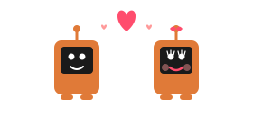

# Hinge Profile Optimizer for Claude Code, Codex, and ChatGPT

**A research-backed Agent Skill for rebuilding a Hinge profile in about 45 minutes**

[](https://github.com/b1rdmania/hinge-profile-optimizer/releases/latest)
[](https://github.com/b1rdmania/hinge-profile-optimizer/actions/workflows/check-plugin-skill.yml)
[](LICENSE)

<p align="center">
  
</p>

---

Everyone has something. The way they think, what they care about, their weird specific interests, how they show up for people, what makes them laugh.

Most dating profiles bury this under generic prompts and bad photo choices.

This skill finds it and puts it where people can see it.

It can audit profile screenshots, choose and order photos, interview you for better material, write prompts and captions in your voice, review settings, or diagnose weak match quality. Use the full process or ask for one part.

> Independent, unofficial project. Not affiliated with or endorsed by Hinge or Match Group.

## Start here

1. Upload your current profile screenshots or candidate photos. Crop or blur names, workplaces, exact locations, children, and unrelated faces if they are not needed.
2. Say what you want to change: more matches, better-fit matches, stronger photos, less generic prompts, or a complete rebuild.
3. The skill will either start the full process or jump directly to the relevant phase.

---

## Time

**45 minutes.**

Not a quick fix. Not "5 tips for better prompts."

This is the full process: honest audit, proper interview, photo strategy, copy that sounds like you, settings cleanup, and help putting it live.

Whether you want a life partner, a good date, or something casual, the profile should still be recognisably yours.

---

## This Isn't Copy-Paste Advice

Most "profile tips" give you a template and send you on your way. Generic prompts, generic results.

This is a **structured 8-phase process** that actually gets to know you first:

| Phase | What Happens |
|-------|--------------|
| [Setup](SKILL.md#phase-0-setup--framing) | Frame the process, understand your situation |
| [Audit](references/audit-criteria.md) | Score your current profile (skip if starting fresh) |
| [Discovery](references/discovery-questions.md) | The big interview - find what actually makes you *you* |
| [Reality Check](SKILL.md#phase-3-reality-check) | Honest market math - who are you competing for? |
| [Photos](references/photo-guidelines.md) | Evaluate, order, identify gaps |
| [Copy](references/copy-principles.md) | Write prompts using *your* material, not templates |
| [Settings](references/hinge-settings.md) | Optimize visibility, hide the clutter |
| [Implementation](SKILL.md#phase-7-implementation) | Put it live together |
| [Algorithm](SKILL.md#phase-8-algorithm-strategy) | What to do in weeks 1-4 |

**Why it works:** The discovery phase is the key. Most advice is generic because it doesn't know you. This spends real time understanding your humor, opinions, relationships, weird rituals — then uses those as ingredients. Your 92-year-old great uncle who dominates pub quiz? That's going in the profile.

---

## The Research

This isn't vibes. It's grounded in published research from actual journals, data from dating platforms, and practical experience — and we're honest about which is which.

**People decide fast, and mostly from photos.** Users spend seconds on a profile, and most of that time goes to photos (Brand et al., 2012). Photos drive the swipe. But on prompt-based apps like Hinge, text matters more than people assume — creative, original profiles are independently rated as more attractive, even controlling for photos (Fiore et al., 2008).

**Specific language beats generic language.** This is one of the strongest findings. "Jazz Cafe on a weeknight" works better than "live music" — and we know why. Toma & Hancock (2012) found that specific, concrete language is a linguistic marker of honesty. Vague, abstract phrasing is a marker of deception. Readers pick up on this without knowing they're doing it. Separately, specific language creates a feeling of closeness — naming a real place puts someone there, while a category keeps them at arm's length (Trope & Liberman, 2010).

**Showing beats telling.** Writing "I have dark humor" tells people nothing — anyone can claim any trait. Writing "Being nice about Timothee Chalamet" demonstrates it. Signaling theory (Donath, 2007) explains the difference: a demonstrated quality is a costly signal — hard to fake, therefore credible. A stated quality is a cheap signal — easy to fake, therefore ignored.

**Humor works, but only if you're actually funny.** Humor in profiles increases perceived attractiveness and reads as a signal of intelligence (McGee & Shevlin, 2009). Producing humor matters more than claiming to appreciate it (Bressler & Balshine, 2006). Failed humor is worse than no humor.

**The market is unequal.** Bruch & Newman (2018), published in *Science Advances*, analyzed 200,000 users and found that desirability follows a power law. Most people pursue partners roughly 25% more desirable than themselves. The top profiles receive wildly disproportionate attention. This is why the skill focuses on differentiation and filtering rather than broad appeal — you're not trying to be liked by everyone.

29 cited studies, platform data from Hinge and OkCupid, plus foundational work on signaling theory and self-disclosure. Every claim tagged with its evidence tier. Full citations in [`references/research-findings.md`](references/research-findings.md).

---

## Install

The repository keeps `SKILL.md` at the root for existing standalone installations and packages a self-contained copy under `skills/hinge-profile-optimizer/` for plugin hosts.

### Codex

Install the standalone skill directly from GitHub:

```bash
npx skills add b1rdmania/hinge-profile-optimizer --full-depth
```

Invoke `$hinge-profile-optimizer`, or ask Codex to audit or rebuild a Hinge profile.

### ChatGPT and the OpenAI Plugins Directory

The repository includes `.codex-plugin/plugin.json` for the Plugins Directory shared by ChatGPT and Codex. Once OpenAI approves and publishes the listing, install **Hinge Profile Optimizer** from the directory and start with screenshots, a photo set, or a request for a fresh profile.

Until publication, the ZIP attached to the latest GitHub release can be uploaded through the [OpenAI plugin submission portal](https://platform.openai.com/apps-manage) by the verified publisher.

### Claude Code

Load it as a plugin from a local checkout:

```bash
claude --plugin-dir ./hinge-profile-optimizer
```

Existing personal-skill installations that point at the repository root continue to work.

### Claude Desktop or Claude.ai

Download the repository and add `SKILL.md` plus the seven files under `references/` to project knowledge or the current conversation. Then ask: *“Help me optimise my Hinge profile.”*

### SkillsMP

The standalone skill is also listed on [SkillsMP](https://skillsmp.com/skills/b1rdmania-hinge-profile-optimizer-skill-md).

## Plugin distribution

- **Claude Code:** `.claude-plugin/plugin.json` exposes the packaged skill while the existing marketplace entry remains available.
- **Codex and ChatGPT:** `.codex-plugin/plugin.json` exposes the same skill through a skills-only plugin.
- **No account or service required:** the plugin contains instructions and research references only. It has no MCP server, authentication, telemetry, or external data store.
- **Sensitive uploads:** users are encouraged to crop or blur identifying details and unrelated third-party faces before sharing profile screenshots or photos.

Build and check the submission archive with:

```bash
bash scripts/check-plugin-bundle.sh
```

---

## Philosophy

**You're not making someone more appealing. You're making them visible.**

The interesting stuff is already there. A 92-year-old great uncle who's a pub quiz champion. An irrational hatred of a specific celebrity. A hate-watch ritual every Saturday morning. The exhibition catalogue they're prouder of than anything else they've made.

These details get lost in "love to laugh" and "partner in crime."

This process pulls them out.

---

## The Point

There's someone for everyone. They just can't find each other when every profile says the same thing.

This skill helps people show who they actually are to the people who'd appreciate that person.

---

## License

MIT
